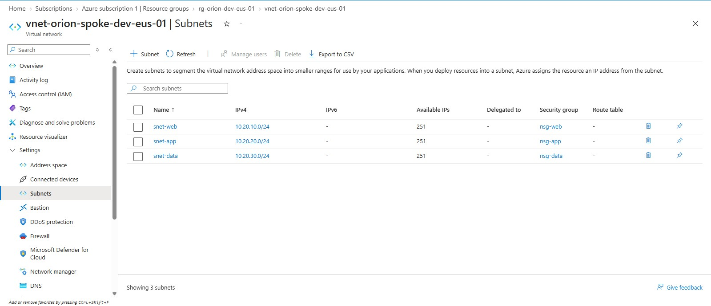
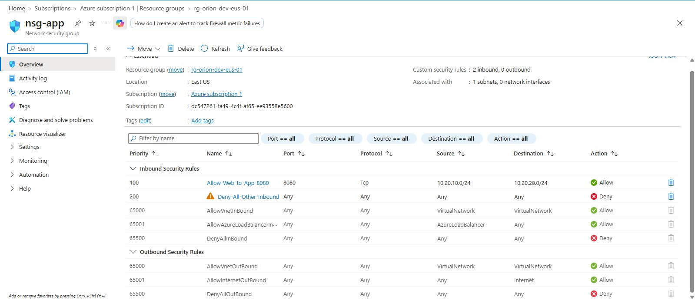
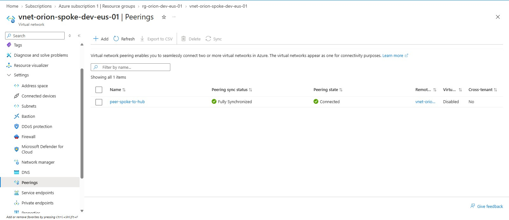

# Secure Azure Enterprise Portfolio

## Project Scope

This project is a personal learning environment for developing Azure cloud engineering skills

### Goal

Build, secure, automate, and monitor a small Azure environment using infrastructure as code.

### Planned Components

- Azure virtual networks and subnets
- Network security groups
- Role-based access control and managed identities
- Terraform infrastructure deployment
- Powershell and Python automation
- GitHub Actions workflows
- Monitoring, alerts, and troubleshooting runbooks

### Boundaries

This project uses synthetic data only.
It will not contain employer, customer, or government information.

### Current Status

The repository is initialized. Infrastructure deployment has not started.

## Network Deployment Evidence

### Spoke Subnetes

The spoke VNet contains separate web, application, and data subnets.

### Application-Tier Security Rules

The app NSG allows inbound TCP 8080 from the web subnet at priority 100 and denies other inbound traffic at priority 200.

### Hub-Spoke Peering

The spoke-to-hub peering shows Connected.

These screenshots demonstrate deployed configuration.
Live workload connectivity testing has not yet been performed.

## Private Endpoint Lab

Configured private access to Azure Blob Storage with public network access disabled. Verifed the endpoint approval, private IP, DNS record, and spoke VNet link.

[View configuration details and screenshots](docs/network-design.md#blobl-storage-private-endpoint)

Live workload connectivity and authorized blob access have not yet been tested.