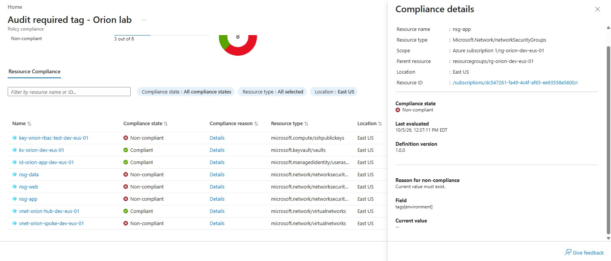
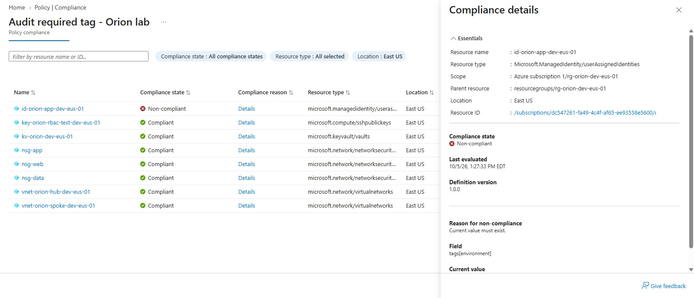
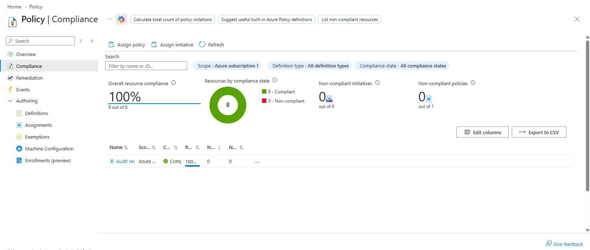

# Azure Policy: Required Tag audit

## Purpose

Use Azure Policy to detect resources missing an environment tag, correct the missing tags, and verify compliance.

## Configuration

- Definition: Audit required tag - Orion lab
- Based on: Require a tag on resources
- Modification: Changed the effect from Deny to Audit
- Category: Tags
- Assignment scope: rg-orion-dev-eus-01
- Tag Name parameter: environment

Audit reports non-compliance without resource changes.
This policy checks whether the tag exists, not whether its value is dev.

## Testing and results

1. Assigned the policy to the lab resource group.
2. Evaluation identified five resources missing the environment tag:
    - Key-orion-rbac-test-dev-eus-01
    - nsg-data
    - nsg-web
    - nsg-app
    - vnet-orion-spoke-dev-eus-01
3. Inspected nsg-app compliance details:
    - Field: tags[environment]
    - Reason: Current value must exist.
4. Added the standard lab tags to the affected resources.
5. Deliberately removed the environment tag from id-orion-app-dev-eus-01 and saved the change.
6. After evaluation updated, seven of eight resources were compliant.
7. Restored environment = dev on the managed identity.
8. After reevaluation, all eight resources were compliant.

## Evaluation timing

Compliance results did not update immediately after tag changes.
I requested a resource-group evaluation using:

```powershell
az policy state trigger-scan --resource-group rg-orion-dev-eus-01
```

The portal displated updated results while the CLI was still waiting.
I verified the results in the portal.

## Evidence

### Missing tag detected



### Controlled test: seven of eight compliant



### All eight resources compliant after correction



## Lessons learned

- Resource-group tags are not automatically inherited by resources.
- Audit detects a problem but does not block or automatically fix it.
- Compliance results can lag behind configuration changes.
- Compliance with this policy proves only that the environment tag exists. It does not prove overall security or compliance with other standards.

## Final state

- All eight evaluated resources were compliant at the final check.
- The managed identity's environment = dev tag restored.
- The policy definition and assignment remain in place for the lab.