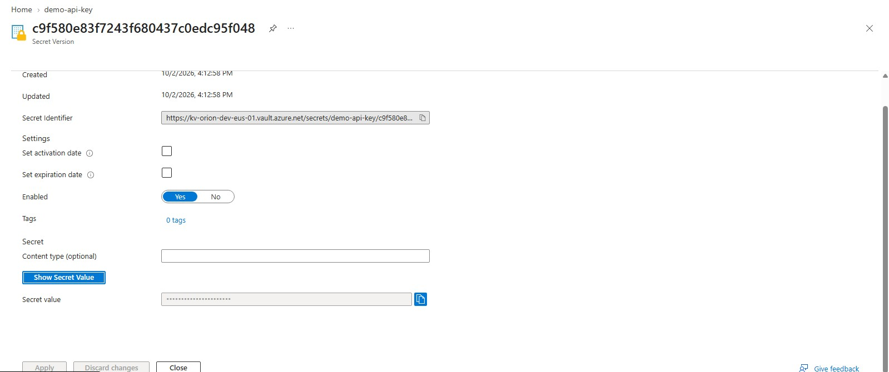
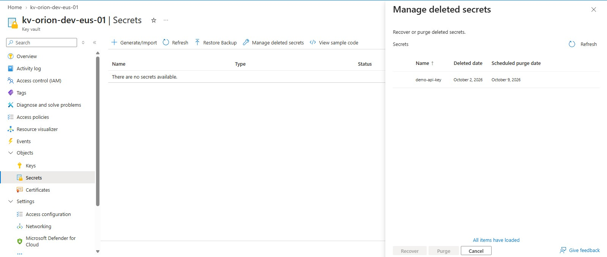
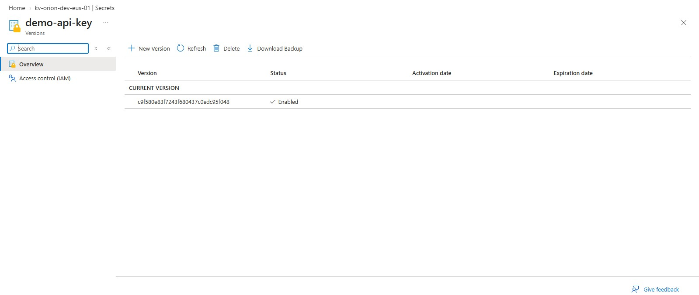

# Key Vault Lab

## Purpose

Practice storing a synthetic secret, controlling access, and recovering from accidental deletion

## Configuration

Setting                 |       Value
Vault                       kv-orion-dev-eus-01
Resource group              rg-orion-dev-eus-01
Region                      East US
Pricing tier                Standard
Permission model            Azure RBAC
Soft-delete retention       7days
Purge Protection            Disabled for this disposable lab
Network Access              Public endpoint, selectded networks
Firewall rule               My current public IPv4 address
Trusted-services bypass     Disabled

The firewall controls which networks can reach the vault's data endpoint. RBAC separately controls permitted secret operations.

Purge protection was disabled to permit permanent lab cleanup.
It would protect important secrets against premature permanent delete during the retention period.

## Access Assignment

My lab user account received Key Vault Secrets Officer at the vault scope to create, read, delete, and recover the test secret.

My inherited Owner role permits resource and access management, but does not automatically grant secret-value access through RBAC.

These tests used my user account. Managed-identity secret retrieval has not been tested in this lab

## Secret Creation and Read Test

Created a secret named demo-api-key containing a deliberately fake API key. Opened its current version and verified the expected value.

No real credentials were used. Secret values are hidden in screenshots.

## Soft-Delete and Recovery Test

1. Deleted demo-api-key from the active Secretes lists.
2. Confirmed it appeared in Manage deleted secrets.
3. Recovered the secret.
4. Confirmed it returned to the active list.
5. Opened its current version and manually verified the value matched.

These screenshots capture the deleted and recovered states.
Value preservation was checked manually.

## Leassons Learned

- Soft delete makes delete secrets recoverable during retention.
- Purge protection permists soft deletion but blocks permanent deletion until the retention period ends.
- Network access and authorization are separate controls.
- Secret operations are data-plane operations. The Azure Activity log was not the appropriate evidence source for this test.
- Key Vault audit logging was not configured for this exercise.
- Use managed identity directly when the target service suppoprts it.
- Store a secret only when the application genuinely needs one.

## Cleanup Status

- Deleted kv-orion-dev-eus-01 after completing the synthetic-sercret lab.
- Confirmed the vault appeared under Manage deleted vaults.
- Left the vault soft-deleted without recovering or purging it.
- Deleted the unused Azure SSH public key resource key-orion-rbac-test-dev-eus-01.
- Retained the hub and spoke VNets, three NSGs, and user-assigned managed identity.
- Retained the Azure Policy audit definition and assignment.

Screenshots and test results remain in this repository as evidence of the completed lab.