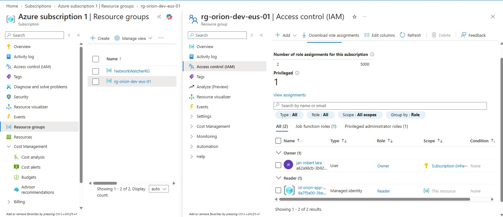
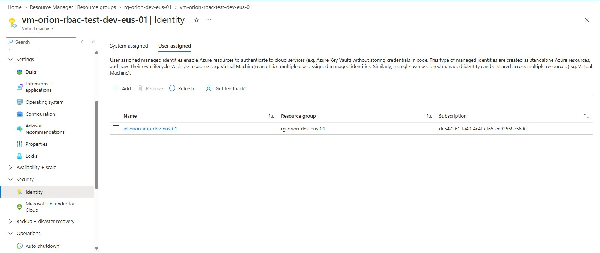
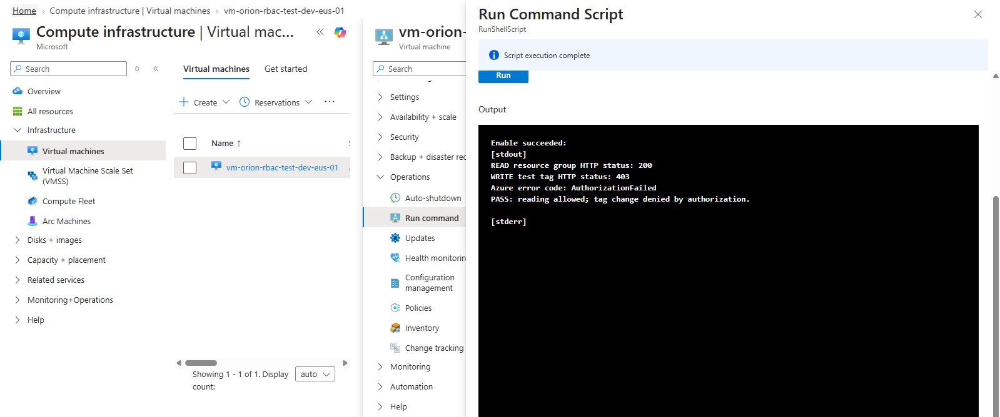

# Identity and RBAC

## Purpose

Apply least privilege and test permissions using a managed identity rather than my personal account's inherited Owner access.

## Access Matrix

Principal               |   Role          |   Scope             |   Reason
Personal administrator    Owner,inherited   Subscription         Administer the personal lab
id-orion-app-dev-eus-01     Reader          rg-orion-dev-eus-01     Inspect lab resource settings without changing them

The managed identity uses a user-assigned lifecycle: it exists independently of the VM and can be attached to a replacement VM.

Reader provides management-plane visibility. It does not grant permission to read blob contents

## VM Identity Attachment

Attached id-orion-app-dev-eus-01 to vm-orion-rbac-test-dev-eus-01.
The VM's system-assigned identity was disabled

The test explicitly selected the user-assigned identity by Client ID and requested an Azure Resource Manager token.

## Live Authorization Tests

Action                          |       Result                  |       Interpretation
Read resource group properties      HTTP 200                            Allowed
Attempt to merge a test tag         HTTP 403, AuthorizationFailed       Denied

Both tests ran inside the VM using the managed identity.
The denied request did not add the test tag.
No access tokens or private keys were included in the evidence.

## Troubleshooting: Incorrect Scope

The initial Reader assignment was on the managed identity resource, rather the intended resource group.

Comparing portal assignments with CLI results exposed the scope mismatch. The assignment was corrected to the resource group and verified with CLI.

Lesson: the IAM page where an assignment is created determines its scope; the selected member determines who receives access.

## Evidence

## Cleanup

The temporary test VM, OS disk, NIC, public IP, and SSH public key resource were deleted after evidence collection

The user-assigned identity id-orion-app-dev-eus-01 and its Reader assignment at the lab resrouce-group scope were retained.
The identity survived VM deletion because its lifecycle is independent.

The two VNets and three NSGs were also retained.